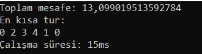
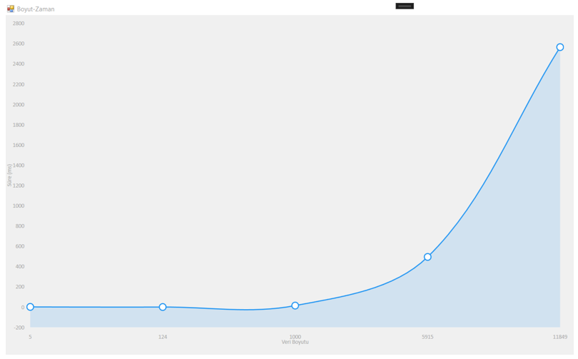

<h1>Algoritma Analizi ve Tasarımı Dersi - Gezgin Satıcı Problemi(Traver Salesman Problem)</h1>
<h3>1. Giriş</h3>

TSP (Travelling Salesman Problem), bir kişinin veya bir elemanın belirlenen şehirler doğrultusunda her bir şehri en az bir kez ziyaret ederek başladığı şehre geri dönmesi için oluşturulan bir rota problemidir. Bu ödevin amacı ise bu probleme dayanarak bu kişinin hesaplanan en kısa rotaya göre(tüm şehirleri dolaşması şartı ile) gidip, en az maliyetle başladığı şehire geri dönmesidir. Bu sayede bu kişi zamandan, bütçeden, yakıttan vs. tasarruf etmiş olacaktır.
Bu uygulamada Gezgin satıcı problemi(Traver Salesman Problem)'nin bruteforce yaklaşımı ile çözümü ele alınmıştır.
Bruteforce yaklaşımı düşük ölçekli dosyalar için global optimum çözüme yakınsar ancak yüksek boyutlu
dosyalar için ise malesef bu işlem hem memory hem zaman açısından çok maliyetli olur, bunun için ise
örneğin, greedy algoritma gerçeklenebilir, greedy algoritma hem memory hem zaman açısından oldukça
verimli olur makul sürede çözümü gerçekleştirir ancak bunun da dezavantajı global aramada başarısız
olması ve local çözümler üretmesidir.

<b>Örnek bir çıktı:</b> 

<h3>2. Geliştirme Ortamı ve Kullanılan Dil</h3>
Visual Studio (Console Application(.Net)) - C#

<h3>3. Çalıştırılan Farklı Girdi Dosyalarına Göre Ortaya Çıkan Sonuç</h3>

Şekilde 5,124, 1000, 5915, 11849 boyutlu dosyalar için boyut-zaman diyagramı görülmektedir, burada TSP probleminin çözümü olarak NearestNeighbor algoritması kullanılmıştır, şekile bakıcak olursak, veri boyutu arttıkça algoritmamızın daha fazla zorlandığı görülmektedir. Bu da demek oluyor ki çok fazla (100.000,1.000.000 vs.) gibi veri boyutlarında bu algoritmayı kullanarak bu problemi çözmek mümkün olmayacaktır. Bu sebeple çok yüksek boyutlu veriler için daha efektif algoritmalar(evrimsel algoritmalar vs.) kullanılması gerekmektedir.

<h3>4. Kurulum</h3>
Uygulamayı indirdikten sonra start ikonuna basarak çalıştırabilirsiniz.
  
<b>Not: </b>Kullanılan girdi dosyalarını "Datas" klasörünün içerisinde bulabilirsiniz.(tsp_5_1.txt,tsp_124_1.txt ...)
